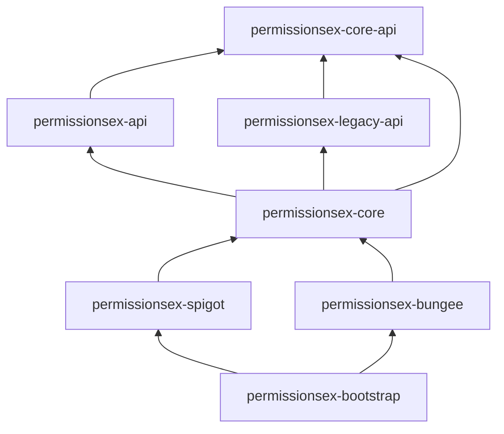

# PermissionsExPlus

PermissionsExPlus is a maintained fork of the original PermissionsEx (PEX) plugin for Bukkit/Spigot servers.

The goal of this fork is to keep PermissionsEx usable on modern server environments, preserve the familiar command structure, and continue maintenance for server administrators who still rely on PEX-style permission management.

## Overview

PermissionsExPlus provides a flexible permissions system with support for users, groups, inheritance, prefixes, suffixes, timed permissions, multi-world setups, and promotion ladders.

This fork is based on the original PermissionsEx project and keeps the same core plugin identity and command style where practical.

**Maven:** parent **`dev.rono.permissions:PermissionsExPlus`**. Module stack: **`permissionsex-core-api`** (platform-neutral SPI) ← **`permissionsex-api`** (modern façade) + **`permissionsex-legacy-api`** (classic façade) → **`permissionsex-core`** (engine) ← **`permissionsex-spigot`** / **`permissionsex-bungee`**. Third-party compile surfaces use **`permissionsex-api`** and/or **`permissionsex-legacy-api`** as needed. **`permissionsex-bootstrap`** merges the platform jars.



## Features

- User and group permission management
- Group inheritance and hierarchy support
- Prefix and suffix management
- Timed permissions and timed group membership
- Multi-world permission handling
- Permission ladder promotion and demotion
- Runtime backend inspection and switching
- UUID conversion support
- Debug and reporting tools

## TODO

The following features and improvements are planned for PermissionsExPlus:

- [ ] Update compatibility for newer Bukkit/Spigot/Paper versions
- [ ] Improve reload stability and permission attachment refresh behavior
- [ ] Add better validation and error messages for invalid configuration files
- [ ] Improve tab completion and command usability
- [ ] Add migration helpers for older PermissionsEx data layouts
- [ ] Expand UUID migration and offline player handling
- [ ] Improve backend compatibility and database reliability
- [ ] Add automated tests for core permission resolution logic
- [ ] Clean up legacy code paths and deprecated API usage
- [ ] Add clearer logging and debug output for permission resolution issues
- [ ] Improve documentation and setup examples
- [ ] Add example configurations for common server setups
- [ ] Add CI builds and automated release packaging
- [ ] Investigate a web editor or external management UI
- [ ] Investigate support for modern platform abstractions and future API changes

## Maven

If you are building from source with Maven:

```bash
mvn clean package
```

The compiled plugin jars are produced under each module’s `target/` directory (see **Universal merged jar** below).

### Universal merged jar (Spigot/Paper **and** Bungee proxy)

Use the **`bootstrap`** module when you want **one artifact** that works on backends and proxies:

```bash
mvn clean package -pl bootstrap -am
```

Outputs: **`bootstrap/target/PermissionsExPlus-{version}.jar`** (module: **`dev.rono.permissions:permissionsex-bootstrap`**)

Install that jar on each server (`plugins/` on backends, same path on Bungee). See **`bootstrap/README.md`** for loader routing (`plugin.yml` vs **`bungee.yml`**).

**Before swapping to the merged jar, remove older PEX jars** from **`plugins/`** so the server cannot load two copies. Delete any shaded platform-only jars, for example:

- **`permissionsex-spigot-*.jar`** and **`permissionsex-bungee-*.jar`** (modular shaded builds under **`dev.rono.permissions`**)
- Older coordinates: **`ru.tehkode:permissionsex-*`**
- Legacy fork jar names if present: **`PermissionsExPlus-spigot-*.jar`**, **`PermissionsExPlus-bungee-*.jar`**, **`PermissionsExPlus-bootstrap-*-universal.jar`**

Keep only **`PermissionsExPlus-{version}.jar`** on that installation when using the bootstrap merge path (plus unrelated plugins).

## Installation

1. Build the project with Maven or download a compiled release (**universal jar** recommended if you run both backends and Bungee; see above).
2. Remove conflicting older PermissionsEx jars from **`plugins/`** (standalone **`permissionsex-spigot`** / **`permissionsex-bungee`**, legacy **`PermissionsExPlus-*`** or **`ru.tehkode`** coordinates, etc.) if migrating to **`PermissionsExPlus-{version}.jar`**.
3. Place the jar file (or jars, if using separate proxies/backends intentionally) in your server’s **`plugins/`** directory.
4. Start or restart the server.
5. Configure groups, users, and permissions using commands or configuration files.

## Commands

### Main command

```text
/pex
```

### General commands

```text
/pex - Display help
/pex reload - Reload environment
/pex report - Report an issue with PEX
/pex config <node> [value] - Print or set a config node
/pex backend - Print currently used backend
/pex backend <backend> - Change permission backend on the fly
/pex hierarchy [world] - Print complete user/group hierarchy
/pex import <backend> - Import data from another backend
/pex convert uuid - Bulk convert user data to UUID-based storage
/pex toggle debug - Enable or disable debug mode
/pex help [page] [count] - Show command help
```

### User commands

```text
/pex users list
/pex user <user>
/pex user <user> list [world]
/pex user <user> superperms
/pex user <user> prefix [newprefix] [world]
/pex user <user> suffix [newsuffix] [world]
/pex user <user> toggle debug
/pex user <user> check <permission> [world]
/pex user <user> get <option> [world]
/pex user <user> delete
/pex user <user> add <permission> [world]
/pex user <user> remove <permission> [world]
/pex user <user> swap <permission> <targetPermission> [world]
/pex user <user> timed add <permission> [lifetime] [world]
/pex user <user> timed remove <permission> [world]
/pex user <user> set <option> <value> [world]
/pex user <user> group list [world]
/pex user <user> group add <group> [world] [lifetime]
/pex user <user> group set <group> [world]
/pex user <user> group remove <group> [world]
/pex users cleanup <group> [threshold]
```

### Group commands

```text
/pex groups list [world]
/pex group <group>
/pex group <group> list [world]
/pex group <group> create [parents]
/pex group <group> delete
/pex group <group> add <permission> [world]
/pex group <group> remove <permission> [world]
/pex group <group> swap <permission> <targetPermission> [world]
/pex group <group> set <option> <value> [world]
/pex group <group> weight [weight]
/pex group <group> prefix [newprefix] [world]
/pex group <group> suffix [newsuffix] [world]
/pex group <group> toggle debug
/pex group <group> timed add <permission> [lifetime] [world]
/pex group <group> timed remove <permission> [world]
/pex group <group> users
/pex group <group> user add <user> [world]
/pex group <group> user remove <user> [world]
```

### Parent and rank commands

```text
/pex group <group> parents [world]
/pex group <group> parents list [world]
/pex group <group> parents set <parents> [world]
/pex group <group> parents add <parents> [world]
/pex group <group> parents remove <parents> [world]
/pex default group [world]
/pex set default group <group> <value> [world]
/pex group <group> rank [rank] [ladder]
/pex promote <user> [ladder]
/pex demote <user> [ladder]
```

### World commands

```text
/pex worlds
/pex world <world>
/pex world <world> inherit <parentWorlds>
```

## Standalone commands

```text
/promote <user> - Promotes a user to the next group
/demote <user> - Demotes a user to the previous group
```

## Permission Nodes

```text
permissionsex.disabled
```

Disables regex-based permission matching for players who should not have it applied.

## Example Usage

```text
/pex group admin create
/pex group admin add '*'
/pex user Steve group set admin
/pex user Alex add essentials.home
/pex group moderator prefix [Mod]
/pex promote Steve
```

## Why this fork exists

PermissionsEx was widely used, but the original project became unmaintained.

PermissionsExPlus exists to continue that legacy with active fixes, updated compatibility, and a clearer long-term home for the plugin.

## Credits

- Original authors: `t3hk0d3`, `zml`
- Additional fork attribution: `Rono`
- Original project: PermissionsEx

## License

PermissionsExPlus is licensed under the GNU General Public License v2.0 or later.
See the [LICENSE](LICENSE) file for the full text.

## Contributing

Contributions, bug reports, and compatibility fixes are welcome.

Please open an issue or submit a pull request with a clear description of the change.